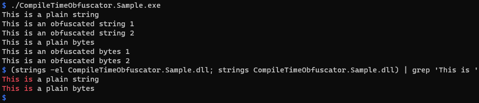

# CompileTimeObfuscator

A C# [Source Generator](https://github.com/dotnet/roslyn/blob/main/docs/features/incremental-generators.md) for obfuscating string or byte array values using multi-byte xor encryption.

Sample code:
```cs
using System;
using System.Buffers;
using System.Text;
using CompileTimeObfuscator;

namespace Sample;
internal static partial class Program
{
    private static string PlainText() => "This is a plain string";

    [ObfuscatedString("This is an obfuscated string 1")]
    private static partial string ObfuscatedText1();

    [ObfuscatedString("This is an obfuscated string 2")]
    private static partial IMemoryOwner<char> ObfuscatedText2();

    private static ReadOnlySpan<byte> PlainBytes() => "This is a plain bytes"u8;

    [ObfuscatedBytes(new byte[] { (byte)'T', (byte)'h', (byte)'i', (byte)'s', (byte)' ', (byte)'i', (byte)'s', (byte)' ', (byte)'a', (byte)'n', (byte)' ', (byte)'o', (byte)'b', (byte)'f', (byte)'u', (byte)'s', (byte)'c', (byte)'a', (byte)'t', (byte)'e', (byte)'d', (byte)' ', (byte)'b', (byte)'y', (byte)'t', (byte)'e', (byte)'s', (byte)' ', (byte)'1', })]
    private static partial byte[] ObfuscatedBytes1();

    [ObfuscatedBytes(new byte[] { (byte)'T', (byte)'h', (byte)'i', (byte)'s', (byte)' ', (byte)'i', (byte)'s', (byte)' ', (byte)'a', (byte)'n', (byte)' ', (byte)'o', (byte)'b', (byte)'f', (byte)'u', (byte)'s', (byte)'c', (byte)'a', (byte)'t', (byte)'e', (byte)'d', (byte)' ', (byte)'b', (byte)'y', (byte)'t', (byte)'e', (byte)'s', (byte)' ', (byte)'2', })]
    private static partial IMemoryOwner<byte> ObfuscatedBytes2();

    private static void Main()
    {
        Console.WriteLine(PlainText());
        Console.WriteLine(ObfuscatedText1());
        using var memoryOwnerChar = ObfuscatedText2();
        Console.WriteLine(memoryOwnerChar.Memory.Span.ToString());

        Console.WriteLine(Encoding.UTF8.GetString(PlainBytes()));
        Console.WriteLine(Encoding.UTF8.GetString(ObfuscatedBytes1()));
        using var memoryOwnerByte = ObfuscatedBytes2();
        Console.WriteLine(Encoding.UTF8.GetString(memoryOwnerByte.Memory.Span));
    }
}
```

The result of executing the sample code, and the result of `strings` command indicating that the obfuscation result is not included in a binary:


## Usage

1. Download a source code from this repository.
2. Add project reference to `CompileTimeObfuscator/CompileTimeObfuscator.csproj` in your project settings.
3. Use `CompileTimeObfuscator.ObfuscatedString` and `CompileTimeObfuscator.ObfuscatedBytes` in your source.
  - `CompileTimeObfuscator.ObfuscatedString` can obfuscate a string. The return type of the method can be a `string` or `System.Buffers.IMemoryOwner<char>`.
  - `CompileTimeObfuscator.ObfuscatedString` can obfuscate a byte array. The return type of the method can be a `byte[]` or `System.Buffers.IMemoryOwner<byte>`.
  - For both attribute cases, I recommend using the `IMemoryOwner<T>` version if execution efficiency is a priority. `string` or `byte[]` versions are wrappers on `IMemoryOwner<T>` version with additional conversion.
  - For both attribute cases, you can configure xor key length and whether the deobfuscated buffer is to be filled to zero when the `IMemoryOwner<T>.Dispose` method is called. To configure, add attribute arguments:

```cs
using CompileTimeObfuscator;
public partial class C
{
    [ObfuscatedString("test", KeyLength = 1, ClearBufferWhenDispose = false)]
    public static partial string M();
}
```

## Sample of source generation results

The generator generates a following source after initialization:

```cs
// <auto-generated/>
#nullable enable

using System;
using System.Buffers;
using System.Diagnostics;

namespace CompileTimeObfuscator;

/// <summary>Obfuscate the specified string to preventing the string from appearing in a metadata. The obfuscated string is deobfuscated at runtime. The method must return <see cref="string"/> or <see cref="IMemoryOwner{T}"/> of type <see cref="char"/>.</summary>
[Conditional("COMPILE_TIME_ONLY")]
[AttributeUsage(AttributeTargets.Method, AllowMultiple = false, Inherited = false)]
internal sealed class ObfuscatedStringAttribute: Attribute
{
    /// <summary>Initializes a new instance of the <see cref="ObfuscatedStringAttribute"/> with the specified string.</summary>
    /// <param name="value">The string to obfuscate.</param>
    internal ObfuscatedStringAttribute(string value)
    {
    }

    /// <summary>Indicates the key length to obfuscate. A default value is 16.</summary>
    public int KeyLength = 16;

    /// <summary>Indicates whether a deobfuscated buffer will cleared after disposing an <see cref="IMemoryOwner{T}"/> object. A default value is true.</summary>
    public bool ClearBufferWhenDispose = true;
}

/// <summary>Obfuscate the specified bytes to preventing the bytes from appearing in a metadata. The obfuscated bytes is deobfuscated at runtime. The method must return <see cref="byte"/>[] or <see cref="IMemoryOwner{T}"/> of type <see cref="byte"/>.</summary>
[Conditional("COMPILE_TIME_ONLY")]
[AttributeUsage(AttributeTargets.Method, AllowMultiple = false, Inherited = false)]
internal sealed class ObfuscatedBytesAttribute: Attribute
{
    /// <summary>Initializes a new instance of the <see cref="ObfuscatedBytesAttribute"/> with the specified bytes.</summary>
    /// <param name="value">The bytes to obfuscate.</param>
    internal ObfuscatedBytesAttribute(byte[] value)
    {
    }

    /// <summary>Indicates the key length to obfuscate. A default value is 16.</summary>
    public int KeyLength = 16;

    /// <summary>Indicates whether a deobfuscated buffer will cleared after disposing an <see cref="IMemoryOwner{T}"/> object. A default value is true.</summary>
    public bool ClearBufferWhenDispose = true;
}

internal sealed class ClearableBuffer<T> : IMemoryOwner<T>
{
    private T[]? _array;
    private readonly int _length;
    private readonly bool _clearBufferWhenDispose;

    internal ClearableBuffer(int length, bool clearBufferWhenDispose)
    {
        _array = ArrayPool<T>.Shared.Rent(length);
        _length = length;
        _clearBufferWhenDispose = clearBufferWhenDispose;
    }

    public void Dispose()
    {
        if (_array is null) { return; }

        // Even if clearArray parameter of ArrayPool<T>.Shared.Return is set to true,
        // the array will not be cleared if the array is not returned to the pool.
        // Therefore, clear the array manually here.
        if (_clearBufferWhenDispose)
        {
            _array.AsSpan().Fill(default!);
        }

        ArrayPool<T>.Shared.Return(_array);
        _array = null;
    }

    /// <summary>Returns <see cref="Memory{T}"/> that length is the originally required length. This behavior is different from an <see cref="IMemoryOwner{T}"/> returned from <see cref="MemoryPool{T}.Shared"/>.</summary>
    public Memory<T> Memory
    {
        get
        {
            if (_array is null) { throw new ObjectDisposedException(GetType().FullName); }

            return new Memory<T>(_array, 0, _length);
        }
    }
}
```

For a following sample code:

```cs
using CompileTimeObfuscator;

public partial class C
{
    [ObfuscatedString("test")]
    public static partial string M1();
}
```

A generator generates a following code, where key takes a different value for each generation:
```cs
// <auto-generated/>
#nullable enable

public partial class C {
    public static partial string M1()
    {
        // The compiler optimize a code if `new byte[]{...}` is converted to ReadOnlySpan<byte>. https://vcsjones.dev/csharp-readonly-span-bytes-static/
        System.ReadOnlySpan<byte> obfuscatedValue = new byte[]{117,226,34,33,148,30,41,116};
        System.ReadOnlySpan<byte> key = new byte[]{1,226,71,33,231,30,93,116,226,66,50,253,253,60,3,216};
        using var buffer = new CompileTimeObfuscator.ClearableBuffer<char>(obfuscatedValue.Length / 2, clearBufferWhenDispose: true);
        var span = buffer.Memory.Span;
        for (int i = span.Length - 1; i >= 0; i--)
        {
            byte upper = (byte)(obfuscatedValue[2 * i + 1] ^ key[(2 * i + 1) % key.Length]);
            byte lower = (byte)(obfuscatedValue[2 * i + 0] ^ key[(2 * i + 0) % key.Length]);
            span[i] = (char)(upper << 8 | lower);
        }
        return new string(buffer.Memory.Span);
    }
}
```

The same is true when the return type is `IMemoryOwner<char>` or when obfuscating a byte array instead of a string:
```cs
using System.Buffers;
using CompileTimeObfuscator;

public partial class C
{
    [ObfuscatedString("test")]
    public static partial IMemoryOwner<char> M2();

    [ObfuscatedBytes(new byte[] { (byte)'t', (byte)'e', (byte)'s', (byte)'t', })]
    public static partial byte[] M3();

    [ObfuscatedBytes(new byte[] { (byte)'t', (byte)'e', (byte)'s', (byte)'t', })]
    public static partial IMemoryOwner<byte> M4();
}
```

```cs
// omitted
public partial class C {
    public static partial global::System.Buffers.IMemoryOwner<char> M2()
    {
        // omitted
        System.ReadOnlySpan<byte> obfuscatedValue = new byte[]{92,228,183,152,126,175,18,190};
        System.ReadOnlySpan<byte> key = new byte[]{40,228,210,152,13,175,102,190,199,226,250,53,66,54,118,164};
        var buffer = new CompileTimeObfuscator.ClearableBuffer<char>(obfuscatedValue.Length / 2, clearBufferWhenDispose: true);
        // omitted
        return buffer;
    }
}
```

```cs
// omitted
public partial class C {
    public static partial byte[] M3()
    {
        // omitted
        System.ReadOnlySpan<byte> obfuscatedValue = new byte[]{26,241,65,188};
        System.ReadOnlySpan<byte> key = new byte[]{110,148,50,200,144,242,236,138,214,152,182,90,190,251,180,67};
        using var buffer = new CompileTimeObfuscator.ClearableBuffer<byte>(obfuscatedValue.Length, clearBufferWhenDispose: true);
        // omitted
        return buffer.Memory.ToArray();
    }
}
```

```cs
// omitted
public partial class C {
    public static partial global::System.Buffers.IMemoryOwner<byte> M4()
    {
        // omitted
        System.ReadOnlySpan<byte> obfuscatedValue = new byte[]{70,203,42,46};
        System.ReadOnlySpan<byte> key = new byte[]{50,174,89,90,38,90,34,100,22,82,253,238,231,239,130,127};
        var buffer = new CompileTimeObfuscator.ClearableBuffer<byte>(obfuscatedValue.Length, clearBufferWhenDispose: true);
        // omitted
        return buffer;
    }
}
```

Currently, a generator generates a source file for each method.
